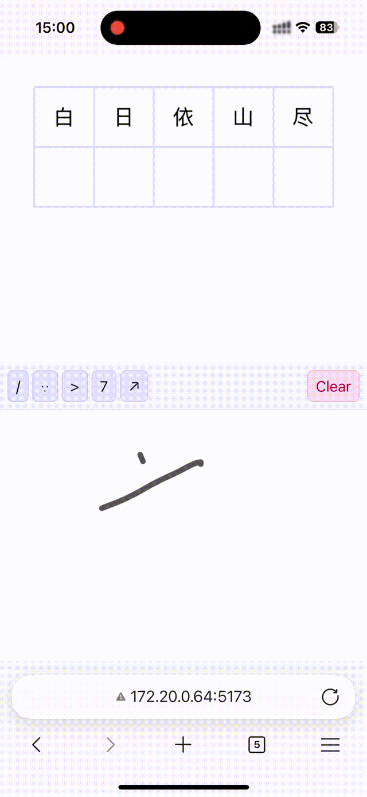

# ochw -  手写汉字识别模型

ochw 是一个基于卷积神经网络的手写汉字识别模型，基于 CASIA-HWDB 1.0 数据集训练，可识别 3740 个汉字和小部分符号。

模型基于 Pytorch 框架开发。

ochw 模型基于 mobilenetv2 模型结构，可以实现在 cpu 上也能做到实时性的识别。


### 作为库使用

```bash
cargo add libochw
```
### 模型模型
```
wget https://huggingface.co/rkingzhong/ochw/resolve/main/ochw_mobilenetv2_fp16.safetensors?download=true
```
### 使用

以 `知` 字图片为例子。


```rust
let weights = include_bytes!("ochw_mobilenetv2_fp16.safetensors");
let worker = Inference::load_model(weights)?;
let labels = worker.get_labels()?;
let image = vec![];//Vec<u8> data
let output = worker.predict(image,Some(10))?;

println!("{:?}",output);
```

结果如下:
```
1. Class 知: 96.17%
2. Class 勉: 0.62%
3. Class 处: 0.28%
4. Class 贮: 0.23%
5. Class 矩: 0.12%
```


### 识别演示

